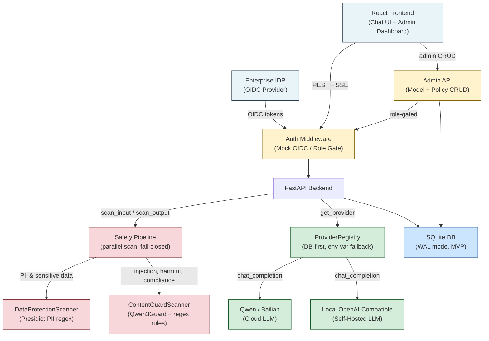
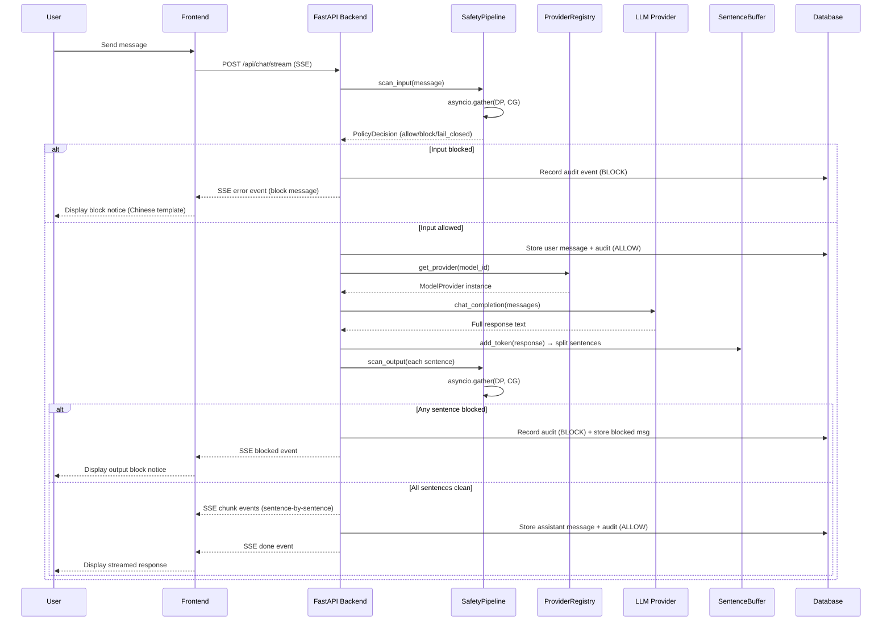
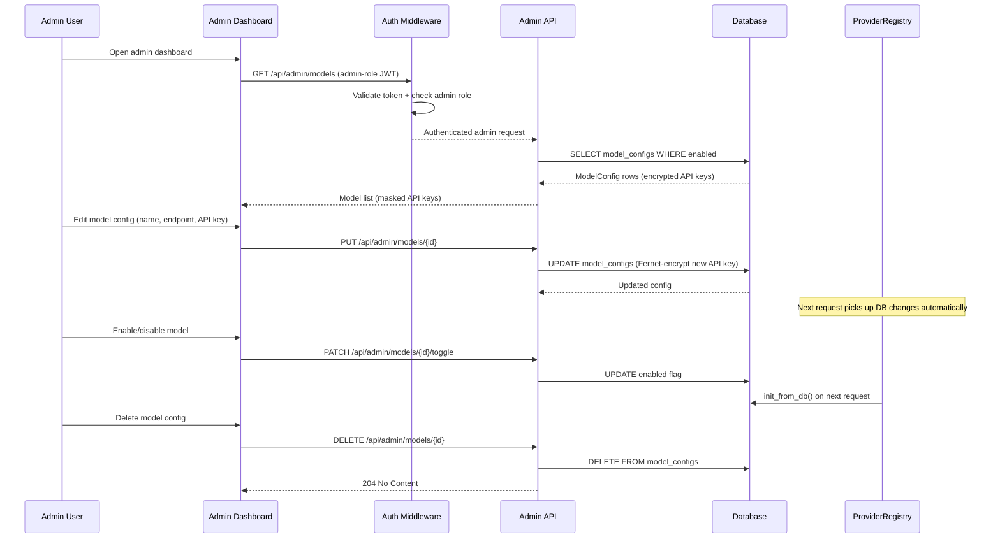
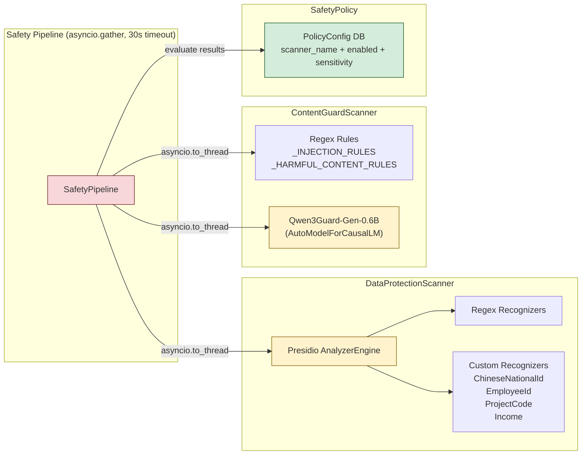
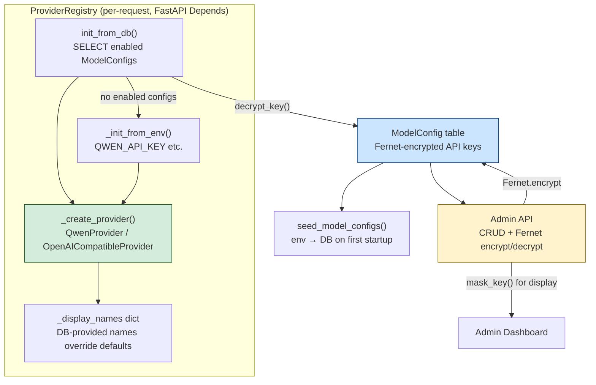
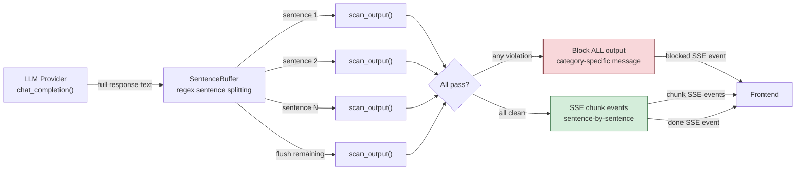

# Architecture Patterns

**Domain:** Enterprise AI chat with safety filtering
**Updated:** 2026-05-23 (reflects actual implemented architecture)

## System Architecture



## Streaming Sequence Diagram



## Admin Configuration Sequence



## Component Boundaries

| Component | Responsibility | Communicates With |
|-----------|---------------|-------------------|
| **React Frontend** | Chat UI, admin dashboard, model selector, conversation sidebar | FastAPI Backend (REST + SSE) |
| **Auth Middleware** | Mock OIDC session validation, role extraction (employee/admin), request gating | Frontend (cookie-based sessions), all backend routes (enforces access) |
| **SafetyPipeline** | Orchestrates parallel scanner execution with 30s timeout and fail-closed semantics | DataProtectionScanner, ContentGuardScanner (asyncio.gather), SafetyPolicy (evaluate results) |
| **DataProtectionScanner** | Presidio-based PII detection (regex-only entities, score threshold 0.7); NLP-dependent recognizers removed to prevent Chinese false positives | SafetyPipeline (called by), Presidio AnalyzerEngine (calls), custom recognizers (ChineseNationalId, EmployeeId, ProjectCode, Income) |
| **ContentGuardScanner** | Qwen3Guard-Gen-0.6B generative model + regex rules for injection, harmful content, jailbreak detection; outputs safe/unsafe structured text parsed to ScannerFinding | SafetyPipeline (called by), Qwen3Guard model (asyncio.to_thread for CPU inference), regex rules (in-process) |
| **ProviderRegistry** | DB-first model provider lookup with Fernet-encrypted API keys; env-var fallback only when DB empty; admin config changes take effect on next request | FastAPI Depends (get_provider_registry), ModelConfig DB table (reads), QwenProvider/OpenAICompatibleProvider (creates) |
| **SentenceBuffer** | Accumulates model response tokens and splits on sentence boundaries (regex); feeds sentences to output safety scan one-by-one | StreamingChatService (called by) |
| **StreamingChatService** | End-to-end chat orchestration: input scan → model call → sentence-buffered output scan → SSE events → DB persistence | SafetyPipeline (scan_input/scan_output), ProviderRegistry (get_provider), SentenceBuffer (split), ConversationRepository + AuditRepository (DB writes) |
| **Conversation Store** | Persists only allowed-through content; blocked messages stored as "blocked" role with category-specific template text, never raw violations | StreamingChatService (stores after safety pass), Frontend (serves history) |
| **Audit Logger** | Creates AuditEvent rows with metadata only (risk categories, scanner names, confidence, policy action); never stores raw sensitive content | SafetyPipeline (receives audit events for both allow and block decisions), Admin Dashboard (serves audit viewer) |
| **Admin API** | CRUD for ModelConfig (encrypted API keys, masked display) and PolicyConfig (scanner enable/disable, sensitivity); restricted to admin role | Auth Middleware (role-gated), Frontend Admin Dashboard, DB (reads/writes configs) |
| **SQLite DB** | MVP persistence with WAL mode and busy_timeout=30s; stores conversations, messages, audit events, model configs, policy configs, users, sessions | All backend components (via SQLAlchemy async ORM) |

## Data Flow

**1. Successful Chat Flow (Allowed Content):**

```
User types message
  → Frontend sends POST /api/chat/stream (SSE, with session cookie)
  → Auth Middleware validates session, extracts role
  → SafetyPipeline.scan_input receives user message
     → asyncio.gather launches parallel scans:
        → DataProtectionScanner: regex-based PII/sensitive data detection (score ≥ 0.7)
        → ContentGuardScanner: regex injection rules + Qwen3Guard generative model
     → Both scanners return ScannerResult with no violations
  → SafetyPipeline.evaluate returns PolicyDecision(action="allow")
  → StreamingChatService stores user message in DB + records ALLOW audit event
  → ProviderRegistry.get_provider(model_id) → returns QwenProvider or OpenAICompatibleProvider
  → provider.chat_completion(messages) → full model response text
  → SentenceBuffer splits response into sentences at punctuation boundaries
  → SafetyPipeline.scan_output checks each sentence
     → All sentences pass safety checks
  → SSE chunk events stream sentences to Frontend
  → SSE done event with conversation_id + message_id
  → DB stores assistant message + ALLOW output audit event
  → Frontend renders streamed response
```

**2. Blocked Input Flow:**

```
User types message
  → Frontend sends POST /api/chat/stream
  → Auth Middleware validates session
  → SafetyPipeline.scan_input receives user message
     → Scanner(s) detect violation:
        → ScannerResult(has_violations=True, findings=[ScannerFinding(category, confidence, anonymized_detail)])
     → SafetyPolicy.evaluate returns PolicyDecision(action="block")
  → SafetyPipeline returns block decision with category-specific Chinese message
  → SSE error event with block message (e.g., "您的消息因包含个人或敏感信息而被拦截。 请移除个人敏感信息后重试。")
  → DB records BLOCK audit event (metadata + risk categories, NO raw content)
  → NO model call made. NO sensitive content stored or echoed.
```

**3. Blocked Output Flow:**

```
Model returns full response text
  → SentenceBuffer splits response into sentences
  → SafetyPipeline.scan_output checks each sentence
     → One or more sentences have violations
  → All output blocked per spec: no partial display
  → Combined risk categories → highest-severity block message template
  → SSE blocked event with Chinese message (e.g., "回复因包含有害或不当内容而被拦截。 请尝试其他问题。")
  → DB stores "blocked" role message (block template, NOT raw model output) + BLOCK audit event
  → NO unsafe model content reaches frontend. NO unsafe content stored raw.
```

**4. Admin Configuration Flow:**

```
Admin opens dashboard
  → Frontend sends GET /api/admin/models (admin-role session)
  → Auth Middleware validates session AND checks admin role
  → Admin API serves model configs (API keys masked via mask_key())
  → Admin modifies model config (name, endpoint, API key)
  → Frontend sends PUT /api/admin/models/{id}
  → Admin API validates, Fernet-encrypts new API key, persists to DB
  → Next chat request: ProviderRegistry.init_from_db() loads updated config
  → Changes take effect immediately — no server restart needed
```

## Scanner Architecture



### Scanner Details

| Scanner | Detection Method | Risk Categories | Key Config |
|---------|-----------------|----------------|------------|
| DataProtectionScanner | Presidio regex recognizers (NLP entities removed) | pii, sensitive_data | score_threshold=0.7, entities=[EMAIL_ADDRESS, PHONE_NUMBER, US_SSN, CREDIT_CARD, IBAN_CODE, IP_ADDRESS, CHINESE_NATIONAL_ID, EMPLOYEE_ID, PROJECT_CODE, INCOME] |
| ContentGuardScanner (regex rules) | 22 injection patterns (English + Chinese), 11 harmful content patterns | prompt_injection, jailbreak, harmful_content | confidence per pattern: 0.80-0.95 |
| ContentGuardScanner (Qwen3Guard) | Generative model: produces "safe/unsafe + category" text output | harmful_content, compliance, pii | max_new_tokens=128, temperature=0, confidence=0.9 on unsafe |

### Block Message Design

Block messages are **category-specific Chinese templates** that never echo detected content:

| RiskCategory | Input Block Message | Output Block Message |
|-------------|--------------------|--------------------|
| pii | "您的消息因包含个人或敏感信息而被拦截。请移除个人敏感信息后重试。" | "回复因包含个人或敏感信息而被拦截。请尝试其他问题。" |
| sensitive_data | "您的消息因包含企业敏感数据而被拦截。请移除敏感标识后重试。" | "回复因包含企业敏感数据而被拦截。请尝试其他问题。" |
| prompt_injection | "您的消息因疑似包含指令注入而被拦截。请用自然语言重新表述。" | "回复因疑似包含操控指令而被拦截。请尝试其他问题。" |
| jailbreak | "您的消息因疑似绕过安全约束而被拦截。请重新表述您的消息。" | "回复因包含越狱内容而被拦截。请尝试其他问题。" |
| harmful_content | "您的消息因包含有害或不当内容而被拦截。请移除不当内容后重试。" | "回复因包含有害或不当内容而被拦截。请尝试其他问题。" |
| compliance | "您的消息因可能违反合规政策而被拦截。请参考组织合规指南。" | "回复因可能违反合规政策而被拦截。请尝试其他问题。" |

Multiple categories → highest-severity template (jailbreak > prompt_injection > harmful_content > pii > sensitive_data > compliance).

## Provider Registry Architecture



### Key Provider Details

- **DB-first**: ModelConfig table is the primary source. Env vars only seed initial configs and serve as fallback when DB is empty.
- **Fernet encryption**: API keys stored as `api_key_encrypted` (Fernet symmetric encryption). `decrypt_key()` used at runtime, `mask_key()` for admin display (shows "sk-...xxxx").
- **Idempotent seeding**: `seed_model_configs()` only populates DB when no ModelConfig records exist. After admin deletes a model, it won't re-appear on restart.
- **Per-request loading**: `get_provider_registry()` is a FastAPI Depends that creates a fresh ProviderRegistry and calls `init_from_db()` each request, so admin changes take effect immediately.
- **Supported providers**: `qwen` (QwenProvider → Bailian/DashScope API) and `openai_compatible` (OpenAICompatibleProvider → any OpenAI-compatible endpoint including Ollama).

## Streaming Safety Pattern



### Pattern: SentenceBuffer + Full-Response-First

Unlike the original design (chunk-by-chunk streaming from LLM), the current implementation:

1. **Gets the full model response first** via `provider.chat_completion()` (not streaming from LLM)
2. **Feeds the full text through SentenceBuffer** which splits on sentence boundaries (`.` `!` `?` `\n`)
3. **Scans each sentence individually** through the safety pipeline
4. **If any sentence has a violation**: block ALL output (no partial display per spec)
5. **If all sentences are clean**: stream them to frontend as SSE chunk events

This approach avoids the complexity of per-chunk buffering from an ongoing LLM stream, while still providing sentence-by-sentence display to the user. The safety guarantee is absolute: any violation in any sentence blocks the entire response.

## Patterns to Follow

### Pattern 1: Scanner Protocol Abstraction

All safety scanners implement the `Scanner` Protocol with standardized types:

```python
class Scanner(Protocol):
    async def scan(self, content: str, source: Literal["input", "output"]) -> ScannerResult: ...

@dataclass
class ScannerFinding:
    category: RiskCategory       # Enum: pii, sensitive_data, prompt_injection, jailbreak, harmful_content, compliance
    confidence: float            # 0.0-1.0
    anonymized_detail: str       # Type labels only, e.g. "Detected SSN pattern" or "Guard model flagged as unsafe (violence)"

@dataclass
class ScannerResult:
    findings: list[ScannerFinding]
    has_violations: bool
    scanner_name: str            # "data_protection" or "content_guard"

@dataclass
class PolicyDecision:
    action: Literal["allow", "block", "fail_closed"]
    risk_categories: list[str]
    block_message: str | None    # Chinese template, never echoes content
    scanner_findings_summary: dict  # Anonymized metadata only
```

Scanners are swappable: ContentGuardScanner replaced LLMGuardrailScanner without changing SafetyPipeline internals. The backward-compatible alias `LLMGuardrailScanner = ContentGuardScanner` keeps existing imports working.

### Pattern 2: Backend-Only Safety Enforcement

The frontend never calls model providers directly. All safety checks run on the backend. The frontend receives only pre-scanned content or Chinese block messages via SSE. This is a hard constraint — if the frontend can bypass safety, the entire pipeline is useless.

### Pattern 3: Audit Metadata Only (No Raw Content Storage)

AuditEvent stores: `risk_categories` (JSON list), `scanner_findings` (JSON dict with anonymized details), `policy_action` ("allow"/"block"/"fail_closed"), `model_id`, `source` ("input"/"output"), `timestamp`, `user_id`. Never stores raw user messages, raw model output, or full PII values that triggered a block.

### Pattern 4: Policy-Driven Scanner Configuration

PolicyConfig DB table stores `scanner_name`, `enabled`, and `sensitivity` for each scanner. SafetyPipeline reads active policy and only runs enabled scanners. Admin can toggle scanners on/off and adjust sensitivity without code changes.

```python
DEFAULT_SCANNERS = ["data_protection", "content_guard"]  # seeded on first startup
```

### Pattern 5: Fail-Closed Semantics

SafetyPipeline uses `asyncio.wait_for(timeout=30s)` and `asyncio.gather(return_exceptions=True)`. If any scanner times out or crashes:
- Scanner returns `None` (not a result)
- Pipeline evaluates with available results only
- If ALL scanners fail → `PolicyDecision(action="fail_closed")`
- Fail-closed block message: "系统处理异常，请稍后重试。" (generic error, no details)

### Pattern 6: DB-First Configuration with Encrypted Secrets

ModelConfig stores `api_key_encrypted` (Fernet-encrypted). Admin API decrypts for provider creation at runtime, masks for display (`mask_key()` → "sk-...xxxx"). ProviderRegistry reads from DB on every request via FastAPI Depends, so admin changes propagate immediately without restart.

## Anti-Patterns to Avoid

### Anti-Pattern 1: Frontend Direct Model Access
All model calls go through the backend ProviderRegistry. Frontend only communicates via `/api/chat/stream` SSE endpoint.

### Anti-Pattern 2: Storing Blocked Content in Database
AuditEvent stores metadata only. Blocked conversation messages store the category-specific template text, not the raw violations. The DB must not become a vault of the sensitive content the pipeline blocks.

### Anti-Pattern 3: Per-Token Safety Checks During Streaming
Individual tokens are too small for reliable detection. The SentenceBuffer accumulates complete sentences before scanning. This balances responsiveness (sentence-by-sentence display) with detection accuracy (meaningful content segments).

### Anti-Pattern 4: Hardcoded Safety Thresholds
Policies stored in PolicyConfig DB table with admin CRUD API. Scanner enable/disable and sensitivity change without code deployment.

### Anti-Pattern 5: Single Scanner for All Checks
Separate scanners with separate capabilities: DataProtectionScanner (Presidio regex for structured PII) and ContentGuardScanner (regex rules + Qwen3Guard generative model for injection/harmful content). Each scanner has distinct detection methods that cannot be combined effectively.

### Anti-Pattern 6: NLP-Based PII Detection on Chinese Text
Presidio's spaCy NLP engine (`en_core_web_lg`) is English-only. It misidentifies normal Chinese words as PII (e.g., "泰山" → LOCATION). Solution: remove all NLP-dependent recognizers (PERSON, LOCATION, DATE_TIME, etc.) and rely only on regex-based recognizers with a 0.7 confidence threshold.

## Project Structure

```
ai_chat_tool/
├── backend/
│   ├── app/
│   │   ├── main.py                 # FastAPI app, CORS, dotenv, lifespan
│   │   ├── api/
│   │   │   ├── chat.py             # POST /api/chat/send (non-streaming)
│   │   │   ├── chat_stream.py      # POST /api/chat/stream (SSE)
│   │   │   ├── conversations.py    # GET /api/conversations, messages CRUD
│   │   │   ├── admin.py            # Admin model/policy CRUD routes
│   │   │   └── auth.py             # Login/logout, session management
│   │   ├── auth/
│   │   │   ├── middleware.py        # Session validation, role extraction
│   │   │   └── oidc_mock.py        # Mock OIDC for MVP
│   │   ├── safety/
│   │   │   ├── scanner_interface.py # Scanner Protocol, ScannerResult, ScannerFinding, PolicyDecision, RiskCategory
│   │   │   ├── pipeline.py          # SafetyPipeline: parallel scan, fail-closed timeout
│   │   │   ├── policy.py            # SafetyPolicy: evaluate scanner results against PolicyConfig
│   │   │   ├── data_protection.py   # DataProtectionScanner: Presidio (regex-only, score≥0.7)
│   │   │   ├── llm_guardrails.py    # ContentGuardScanner: Qwen3Guard + regex rules
│   │   │   ├── block_messages.py    # Chinese category-specific block templates
│   │   │   ├── custom_recognizers.py # ChineseNationalId, EmployeeId, ProjectCode, Income
│   │   │   └── torch_compat.py      # torch.jit patch before transformers import
│   │   ├── streaming/
│   │   │   ├── service.py           # StreamingChatService: input scan → model → buffer → output scan → SSE
│   │   │   └── buffer.py            # SentenceBuffer: regex sentence splitting
│   │   ├── models/
│   │   │   ├── providers.py         # ProviderRegistry: DB-first, _create_provider factory
│   │   │   ├── qwen.py              # QwenProvider: Bailian/DashScope API
│   │   │   └── openai_compatible.py # OpenAICompatibleProvider: any OpenAI-compatible endpoint
│   │   ├── conversations/
│   │   │   ├── repository.py        # Conversation CRUD + message storage
│   │   │   └── models.py            # Pydantic request/response models
│   │   ├── audit/
│   │   │   ├── repository.py        # AuditEvent storage (metadata only)
│   │   │   └── models.py            # Audit event Pydantic models
│   │   ├── admin/
│   │   │   ├── models_repo.py       # ModelConfig CRUD + Fernet encrypt/decrypt/mask
│   │   │   ├── policy_repo.py       # PolicyConfig CRUD + DEFAULT_SCANNERS seeding
│   │   │   └── audit_repo.py        # AuditEvent query for admin viewer
│   │   └── db/
│   │       ├── __init__.py          # init_db(), engine, get_db_session
│   │       ├── schema.py            # SQLAlchemy models: User, Session, Conversation, Message, AuditEvent, ModelConfig, PolicyConfig
│   │       └── seed_data.py         # seed_users(), seed_model_configs() (idempotent)
│   ├── requirements.txt
│   └── enterprise_chat_mvp.db       # SQLite database (WAL mode)
├── frontend/
│   ├── src/
│   │   ├── features/
│   │   │   ├── chat/
│   │   │   │   ├── ChatPage.tsx      # Chat UI with model selector + streaming display
│   │   │   │   ├── useStreamChat.ts  # SSE streaming hook
│   │   │   │   ├── ConversationSidebar.tsx # Conversation list + click to resume
│   │   │   │   ├── BlockedMessage.tsx # Block notice rendering
│   │   │   │   └── ChatStore.ts      # Zustand: selectedModel, activeConversation
│   │   │   └── admin/
│   │   │       ├── AdminLayout.tsx   # Admin page routing
│   │   │       ├── ModelsPage.tsx    # Model config CRUD + delete
│   │   │       ├── PolicyPage.tsx    # Scanner enable/disable + sensitivity
│   │   │       ├── AuditPage.tsx     # Audit event viewer
│   │   │       └── components/       # ModelCard, PolicyCard, etc.
│   │   ├── lib/
│   │   │   ├── api.ts               # apiClient, AuthError, 204 handling, chat API types
│   │   │   └── auth.ts              # Session-based auth helpers
│   │   └── App.tsx                   # React Router setup
│   └── vite.config.ts
├── docs/
│   ├── ARCHITECTURE-DIAGRAM.md       # Standalone mermaid architecture docs
│   ├── FEATURES-TECH-STACK.md        # Feature spec + tech stack
│   └── TEST-CASES.csv                # 54 bilingual test cases
├── .planning/                         # GSD planning artifacts
└── CLAUDE.md                          # Project instructions
```

## Build Progress

| Phase | Status | Key Deliverables |
|-------|--------|-----------------|
| Phase 1: Foundation | **Complete** | FastAPI skeleton, SQLite schema, mock OIDC auth, React frontend skeleton |
| Phase 2: Safety Core | **Complete** | Scanner Protocol, DataProtectionScanner (Presidio), ContentGuardScanner (Qwen3Guard + regex), SafetyPipeline, block messages |
| Phase 3: Model Integration | **Complete** | ProviderRegistry (DB-first), QwenProvider, OpenAICompatibleProvider, StreamingChatService, SentenceBuffer, SSE streaming |
| Phase 4: Admin Dashboard | **Complete** | Admin API (model/policy/audit CRUD), Fernet encryption, admin UI pages (model config, policy config, audit viewer), delete/toggle model |
| Phase 5: Chat UX Polish | **In progress** | Model selection persistence, conversation resume, block message styling, streaming display improvements |

## Scalability Considerations

| Concern | At 100 users (MVP) | At 10K users | At 1M users |
|---------|--------------|--------------|-------------|
| Safety scan latency | Single-process, scanners in-memory, asyncio.to_thread for CPU-bound model inference | Separate scanner worker processes or async scanning | Dedicated scanner service with horizontal scaling |
| Model API throughput | Direct API calls, no queue | Request queuing with rate limiting | Multiple model provider replicas, load balancing |
| SSE connection management | uvicorn handles natively | Connection pool management, timeout policies | Dedicated SSE gateway (reverse proxy with SSE support) |
| Database | SQLite WAL mode, busy_timeout=30s, sufficient for 100 users | Migrate to PostgreSQL (asyncpg), read replicas | Sharded conversations, time-partitioned audit events |
| Audit event volume | Store all events in single SQLite table | Partitioned tables by date, periodic archival | Event streaming to separate analytics store (e.g., ClickHouse) |
| Safety buffer memory | Per-request SentenceBuffer, negligible | Buffer pool with size limits, per-user connection limits | Distributed buffer management, backpressure on model streams |

**MVP scaling target:** 100 internal users, single SQLite instance (WAL mode), single uvicorn process, in-memory scanners. This is the correct starting point — do not over-engineer scaling for the MVP demo. PostgreSQL migration is straightforward since SQLAlchemy abstracts the dialect.

## Sources

- PROJECT.md / CLAUDE.md: Project requirements and constraints
- Actual implementation: scanner_interface.py, pipeline.py, data_protection.py, llm_guardrails.py, block_messages.py, providers.py, streaming/service.py, buffer.py, db/schema.py
- Qwen3Guard-Gen-0.6B documentation: generative guard model for content moderation (Chinese + English)
- Microsoft Presidio documentation: PII detection with regex recognizers (NLP entities excluded for Chinese)
- FastAPI + sse-starlette: SSE streaming patterns