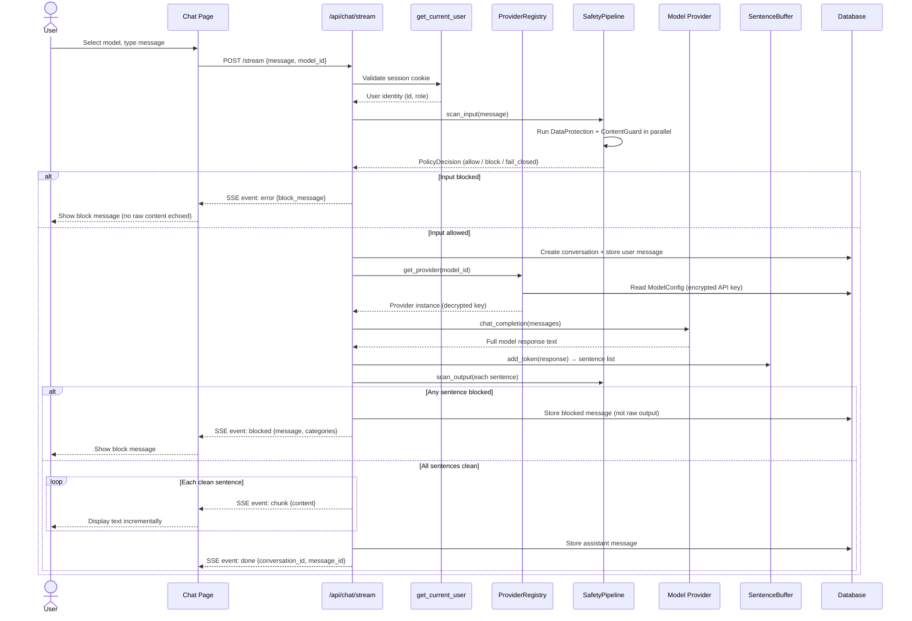
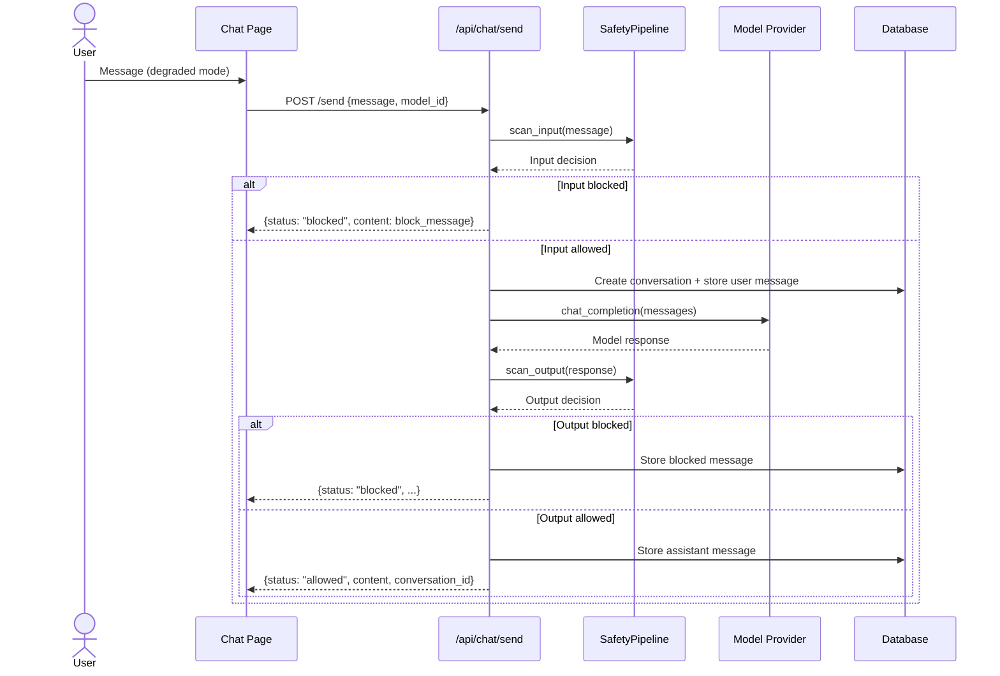
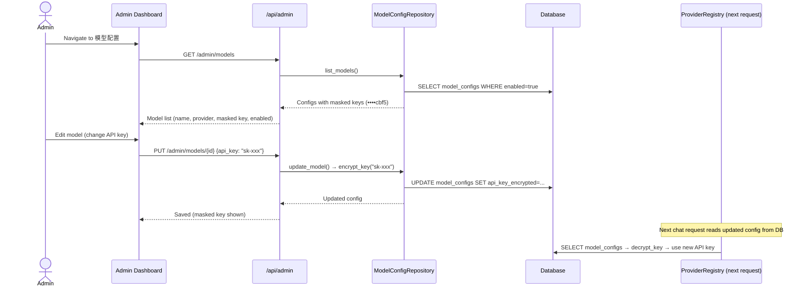

# Enterprise AI Chat MVP — System Architecture

## Architecture Overview

Enterprise AI Chat MVP uses a safety-gated request pipeline architecture: every user message and model response passes through a multi-scanner safety pipeline before proceeding. The system enforces fail-closed semantics — if any scanner crashes, times out, or returns ambiguous results, the content is blocked rather than allowed unfiltered.

```mermaid
graph TB
    subgraph Frontend ["Frontend (React + TypeScript)"]
        AuthPage["Auth Page<br/>Mock OIDC Login"]
        ChatPage["Chat Page<br/>Model Selector + SSE Client"]
        AdminLayout["Admin Dashboard<br/>Audit / Models / Policy"]
    end

    subgraph Backend ["Backend (FastAPI + Python)"]
        AuthRouter["Auth Router<br/>/api/auth"]
        ChatRouter["Chat Router<br/>/api/chat"]
        StreamRouter["Stream Router<br/>/api/chat/stream"]
        ConvRouter["Conv Router<br/>/api/conversations"]
        AdminRouter["Admin Router<br/>/api/admin"]
    end

    subgraph Safety ["Safety Pipeline (Fail-Closed)"]
        SafetyPipeline["SafetyPipeline<br/>Parallel scan + 30s timeout"]
        DataProtection["DataProtectionScanner<br/>Presidio PII + Custom Regex"]
        ContentGuard["ContentGuardScanner<br/>Regex Rules + Qwen3Guard Model"]
        SafetyPolicy["SafetyPolicy<br/>Aggregation → allow/block/fail_closed"]
        BlockMessages["Block Messages<br/>Category-specific Chinese templates"]
    end

    subgraph Models ["Model Providers"]
        ProviderRegistry["ProviderRegistry<br/>DB-first, env-var fallback"]
        QwenProvider["QwenProvider<br/>DashScope API (httpx)"]
        OpenAIProvider["OpenAICompatibleProvider<br/>Local LLM (openai SDK)"]
    end

    subgraph Streaming ["SSE Streaming"]
        StreamingService["StreamingChatService<br/>Orchestrate buffer + scan"]
        SentenceBuffer["SentenceBuffer<br/>Regex sentence splitting"]
    end

    subgraph Persistence ["Database (SQLite WAL)"]
        Users["users"]
        Sessions["sessions"]
        Conversations["conversations"]
        Messages["messages"]
        AuditEvents["audit_events"]
        ModelConfigs["model_configs<br/>Encrypted API keys (Fernet)"]
        PolicyConfigs["policy_configs"]
    end

    subgraph Admin ["Admin Management"]
        ModelsRepo["ModelConfigRepository<br/>CRUD + encrypt/decrypt/mask"]
        PolicyRepo["PolicyConfigRepository<br/>Scanner enable/disable"]
        AuditRepo["AuditRepository<br/>Event recording + queries"]
    end

    %% Frontend → Backend
    AuthPage -->|"OIDC login/callback"| AuthRouter
    ChatPage -->|"POST /send"| ChatRouter
    ChatPage -->|"POST /stream (SSE)"| StreamRouter
    ChatPage -->|"GET /models, /conversations"| ConvRouter
    AdminLayout -->|"GET/POST/PUT/DELETE /admin"| AdminRouter

    %% Backend → Safety
    ChatRouter -->|"input scan → model call → output scan"| SafetyPipeline
    StreamRouter -->|"input scan → model call → sentence-buffered output scan"| SafetyPipeline

    %% Safety Pipeline internals
    SafetyPipeline -->|"parallel scan"| DataProtection
    SafetyPipeline -->|"parallel scan"| ContentGuard
    SafetyPipeline -->|"aggregate findings"| SafetyPolicy
    SafetyPolicy -->|"generate message"| BlockMessages

    %% Backend → Model Providers
    ChatRouter -->|"get_provider(model_id)"| ProviderRegistry
    StreamRouter -->|"get_provider(model_id)"| ProviderRegistry
    ProviderRegistry -->|"DB configs (enabled models)"| ModelConfigs
    ProviderRegistry -->|"Qwen API"| QwenProvider
    ProviderRegistry -->|"OpenAI-compatible"| OpenAIProvider

    %% Streaming internals
    StreamRouter -->|"stream_response()"| StreamingService
    StreamingService -->|"add_token() + flush()"| SentenceBuffer
    StreamingService -->|"scan each sentence"| SafetyPipeline

    %% Backend → Persistence
    AuthRouter -->|"create user/session"| Users
    ChatRouter -->|"store messages"| Messages
    StreamRouter -->|"store messages"| Messages
    ConvRouter -->|"list/get conversations"| Conversations
    AdminRouter -->|"CRUD models"| ModelsRepo
    AdminRouter -->|"CRUD policies"| PolicyRepo
    AdminRouter -->|"query audit stats + events"| AuditRepo

    %% Persistence connections
    ModelsRepo -->|"encrypted keys"| ModelConfigs
    PolicyRepo -->|"scanner config"| PolicyConfigs
    AuditRepo -->|"audit metadata"| AuditEvents

    style SafetyPipeline fill:#f44336,color:#fff
    style DataProtection fill:#ff9800,color:#fff
    style ContentGuard fill:#ff9800,color:#fff
    style SafetyPolicy fill:#f44336,color:#fff
    style BlockMessages fill:#f44336,color:#fff
    style ModelConfigs fill:#4caf50,color:#fff
    style ProviderRegistry fill:#2196f3,color:#fff
```

## Request Flow — Streaming Chat (Primary Path)

## Request Flow — Non-Streaming Chat (Fallback)

## Admin Configuration Flow

## Component Details

| Component | File | Purpose |
|-----------|------|---------|
| SafetyPipeline | `backend/app/safety/pipeline.py` | Coordinates all scanners in parallel with 30s timeout; fail-closed on crash/timeout |
| DataProtectionScanner | `backend/app/safety/data_protection.py` | Presidio PII detection (regex-only entities: EMAIL, PHONE, SSN, CREDIT_CARD, etc.) + custom recognizers (Chinese national ID, employee ID, income, project code). Score threshold 0.7 to avoid Chinese false positives |
| ContentGuardScanner | `backend/app/safety/llm_guardrails.py` | Three-layer detection: (1) regex rules for prompt injection/jailbreak patterns (Chinese + English), (2) regex rules for harmful content requests (hate speech, discrimination), (3) Qwen3Guard-Gen-0.6B generative model for probabilistic detection of content rules don't cover |
| SafetyPolicy | `backend/app/safety/policy.py` | Aggregates all scanner findings → single allow/block/fail_closed decision. Any violation = full block, no partial display |
| Block Messages | `backend/app/safety/block_messages.py` | Chinese-language category-specific templates. Never echoes detected content — only category labels and revision hints |
| ProviderRegistry | `backend/app/models/providers.py` | DB-first: reads ModelConfig table with encrypted API keys. Falls back to env vars only if DB empty. Admin changes take effect on next request |
| ModelConfigRepository | `backend/app/admin/models_repo.py` | CRUD + Fernet encryption/decryption/masking of API keys. `mask_key()` shows last 4 chars only |
| StreamingChatService | `backend/app/streaming/service.py` | Orchestrates: input scan → model call → SentenceBuffer splits response → per-sentence output scan → SSE events. Commits at each write boundary to avoid holding SQLite write lock |
| SentenceBuffer | `backend/app/streaming/buffer.py` | Regex sentence boundary detection. Accumulates tokens, flushes complete sentences |