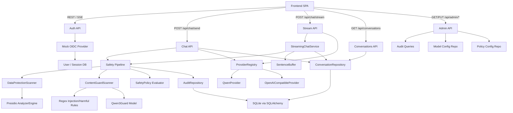

<!-- generated-by: gsd-doc-writer -->

# Architecture

## System Overview

Enterprise AI Chat MVP is a two-tier web application that lets authenticated employees chat with approved LLMs while enforcing a mandatory safety pipeline on every message. The backend (Python/FastAPI) serves as the sole enforcement point — the frontend (React/TypeScript SPA) never calls model providers directly. The core architectural pattern is a **safety-gated request pipeline**: every user message flows through input safety scanning, then a model provider call, then output safety scanning before reaching the user. Blocked content is never echoed — only category-specific template messages are returned. Audit metadata (never raw prompts or PII values) is recorded for every safety decision.

Primary inputs: authenticated user chat messages via REST or SSE endpoints. Primary outputs: model responses (streamed sentence-by-sentence via SSE) or block messages with risk category labels.

## Component Diagram



## Data Flow

The primary data flow for a streaming chat request:

1. **Frontend sends request** — `POST /api/chat/stream` with `{message, model_id, conversation_id}` and session cookie.
2. **Auth gate** — `get_current_user` dependency extracts user from session cookie via DB lookup; 401 if invalid/expired.
3. **Input safety scan** — `SafetyPipeline.scan_input()` runs `DataProtectionScanner` (Presidio PII detection) and `ContentGuardScanner` (regex injection/harmful rules + Qwen3Guard-Gen-0.6B model) in parallel with 30-second timeout. If any scanner finds violations, `SafetyPolicy.evaluate()` returns a `block` decision.
4. **Block on input violation** — If blocked, the entire request is rejected with a category-specific block message (never echoes the flagged content). An audit event is recorded with anonymized metadata only.
5. **Model provider call** — If allowed, `ProviderRegistry.get_provider()` resolves the model ID to a `QwenProvider` (Alibaba DashScope/Qwen via httpx) or `OpenAICompatibleProvider` (local OpenAI-compatible endpoint). The provider's `chat_completion()` method returns the model response.
6. **Sentence-buffered output scan** — `SentenceBuffer` splits the model response into sentences. Each sentence is scanned through `SafetyPipeline.scan_output()`. If any sentence has a violation, the **entire output is blocked** per policy (no partial display).
7. **Stream response to frontend** — Clean sentences are streamed as SSE `chunk` events. A `done` event signals completion. Blocked outputs produce a single `blocked` event with the category-specific message.
8. **Audit recording** — Every decision (allow, block, fail_closed) generates an `AuditEvent` with anonymized scanner findings metadata — never raw prompts, model outputs, or PII values.
9. **Conversation persistence** — User and assistant messages are stored via `ConversationRepository`. Blocked messages are stored with role `"blocked"` containing only the block message template, not the flagged content.

For the non-streaming path (`POST /api/chat/send`), the flow is identical except the response is returned as a single JSON `ChatResponse` object rather than SSE events.

## Key Abstractions

| Abstraction | Purpose | File |
|---|---|---|
| `Scanner` (Protocol) | Interface contract for all safety scanners — `async scan(content, source) -> ScannerResult` | `backend/app/safety/scanner_interface.py` |
| `SafetyPipeline` | Coordinates parallel scanner execution with fail-closed timeout semantics; 30s default timeout | `backend/app/safety/pipeline.py` |
| `SafetyPolicy` | Aggregates scanner findings into allow/block/fail_closed decisions; generates category-specific block messages | `backend/app/safety/policy.py` |
| `PolicyDecision` | Dataclass representing a policy outcome: action, risk_categories, block_message, scanner_findings_summary | `backend/app/safety/scanner_interface.py` |
| `DataProtectionScanner` | Presidio-backed PII/sensitive data scanner; uses regex-based entity detection at 0.7 threshold to avoid NLP false positives on Chinese text | `backend/app/safety/data_protection.py` |
| `ContentGuardScanner` | Multi-layer content guard: regex injection rules + regex harmful content rules + Qwen3Guard-Gen-0.6B generative model for probabilistic detection | `backend/app/safety/llm_guardrails.py` |
| `ModelProvider` (ABC) | Abstract base for model providers with `chat_completion(messages) -> str` | `backend/app/models/providers.py` |
| `ProviderRegistry` | Discovers and manages available model providers based on environment credentials (QWEN_API_KEY, OPENAI_API_BASE) | `backend/app/models/providers.py` |
| `SentenceBuffer` | Accumulates streaming tokens and splits on sentence boundaries for output safety scanning | `backend/app/streaming/buffer.py` |
| `StreamingChatService` | Orchestrates buffer + safety scan + SSE event generation; implements "block entire output on any violation" policy | `backend/app/streaming/service.py` |
| `OIDCProvider` (ABC) | Abstract OIDC provider interface; `MockOIDCProvider` implements mock flow with itsdangerous token signing | `backend/app/auth/oidc.py` |
| `ConversationRepository` | SQLAlchemy-based CRUD for conversations and messages; ownership-filtered queries | `backend/app/conversations/repository.py` |
| `AuditRepository` | Records audit events with metadata-only storage (per SAFE-06: never raw prompts, outputs, or PII values) | `backend/app/audit/repository.py` |

## Directory Structure Rationale

```
backend/
  app/
    api/            # FastAPI route handlers — each router maps to a URL prefix group
      auth.py       # /api/auth — mock OIDC login, callback, /me
      chat.py       # /api/chat — POST /send, GET /models (non-streaming)
      chat_stream.py # /api/chat — POST /stream (SSE streaming)
      conversations.py # /api/conversations — list, get messages
      admin.py      # /api/admin — audit, model config, policy config (admin-only)
    auth/           # Authentication logic
      oidc.py       # OIDCProvider ABC + MockOIDCProvider (itsdangerous tokens)
      current_user.py # FastAPI Depends: get_current_user, get_admin_user
    safety/         # Safety pipeline and scanners — the core enforcement module
      scanner_interface.py # Scanner protocol, PolicyDecision, ScannerResult, RiskCategory
      pipeline.py   # SafetyPipeline — parallel scanner execution with timeout
      policy.py     # SafetyPolicy — evaluate findings into decisions
      data_protection.py # DataProtectionScanner — Presidio PII detection
      llm_guardrails.py # ContentGuardScanner — regex rules + Qwen3Guard model
      custom_recognizers.py # Custom Presidio recognizers (ChineseNationalId, EmployeeId, etc.)
      block_messages.py # Category-specific block message templates (never echo content)
      torch_compat.py # Torch/transformers compatibility patches
    models/         # Model provider integrations
      providers.py  # ModelProvider ABC, ProviderRegistry, dependency
      qwen.py       # QwenProvider — Alibaba DashScope/Qwen via httpx async
      openai_compatible.py # OpenAICompatibleProvider — generic OpenAI-compatible endpoint
    streaming/      # SSE streaming infrastructure
      buffer.py     # SentenceBuffer — sentence-boundary splitting
      service.py    # StreamingChatService — orchestrates buffer + scan + SSE events
    conversations/  # Conversation and message persistence
      repository.py # ConversationRepository — CRUD with ownership filtering
    audit/          # Audit event recording and querying
      events.py     # AuditEventResponse Pydantic model
      repository.py # AuditRepository — metadata-only event recording
    admin/          # Admin data access (separate from API routing)
      audit_queries.py # Paginated audit event queries with multi-dimension filters
      models_repo.py # ModelConfig CRUD with encrypted API key storage
      policy_repo.py # PolicyConfig CRUD for scanner enable/sensitivity settings
    db/             # Database configuration and schema
      __init__.py   # Async engine (SQLite/aiosqlite), session factory, init_db
      schema.py     # SQLAlchemy models: User, Session, Conversation, Message, AuditEvent, ModelConfig, PolicyConfig
      seed_data.py  # Mock user seeding on startup
      migrations/   # Alembic migration infrastructure
    tests/          # Backend test suite

frontend/
  src/
    features/       # Feature-based organization (each feature = a UI domain)
      auth/         # Login, mock OIDC page, auth callback, user info display
      chat/         # ChatPage, ChatMessages, ChatInput, StreamingMessage, BlockedMessage,
                    # ConversationSidebar, ModelSelector, useStreamChat hook
      admin/        # AdminLayout, AuditPage, ModelsPage, PolicyPage, AdminSidebar,
                    # shared components (AuditTable, AuditFilters, ModelCard, etc.)
    stores/         # Zustand state stores
      authStore.ts  # Auth state: user, login, callback, fetchUser, logout
      chatStore.ts  # Chat state: selectedModel, messages, loading, activeConversation
    lib/            # Shared utilities
      api.ts        # apiClient (fetch wrapper), TanStack QueryClient, API type definitions
    app/            # App-level providers
      providers.tsx # QueryClientProvider + AuthRestorer (cookie-based session recovery)
    routes.tsx      # React Router config with ProtectedRoute and AdminRoute guards
    main.tsx        # Vite entry point
    App.tsx         # Root component
    tests/          # Frontend test suite
```

The backend follows a **layered separation**: API routes (`api/`) depend on domain modules (`safety/`, `models/`, `streaming/`, `conversations/`, `audit/`) which depend on data access (`db/`). Each domain module owns its own repository/service class, keeping the API layer thin and the business logic testable in isolation.

The frontend follows a **feature-slice pattern**: each feature directory contains all components, hooks, and sub-components for that UI domain. Global state (Zustand stores) and shared API utilities live in `stores/` and `lib/`, keeping features self-contained while sharing infrastructure.